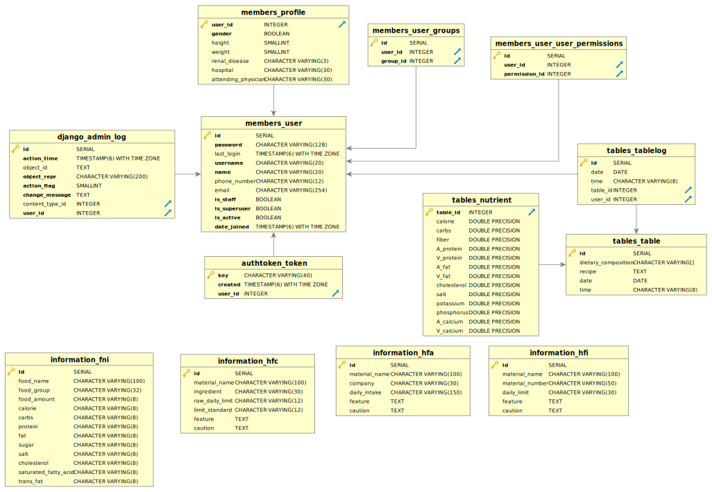

# 8BitStudio 신장케어 프로젝트
만성신부전증 환자의 식단관리를 위한 모바일 어플리케이션 서버(임시코드)
- 식품연구소로부터 제공된 데이터를 기반으로, 신부전증 환자 전용 식단을 제휴업체 및 회원들에게 제공
- 관리자 페이지 일부 개선 및 특정 기능 추가(Excel file -> 식단 Bulk update 등) 

## 주요 기술 스택
- Django REST Framework
- Nginx + uWSGI
- Redis + Celery
- PostgreSQL

## ERD

## API 문서
https://speckled-iron-727.notion.site/Healthcare-Server-API-Documentation-V3-01-0b344234b2284a669e99d91e6274f423
